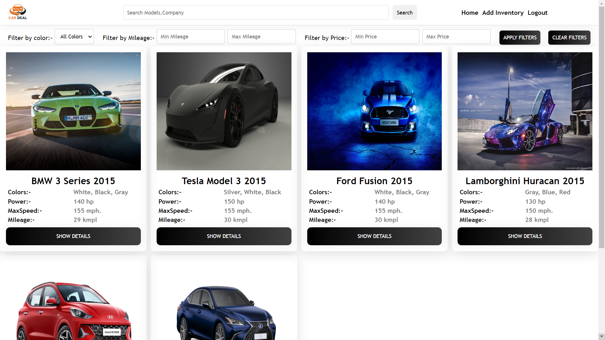
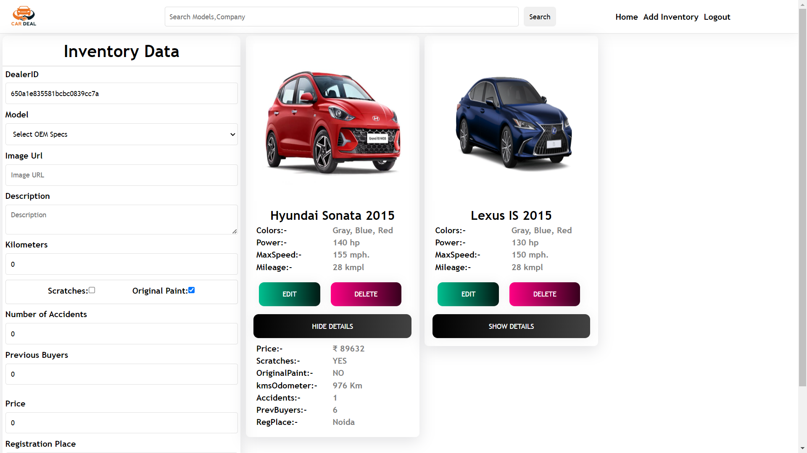
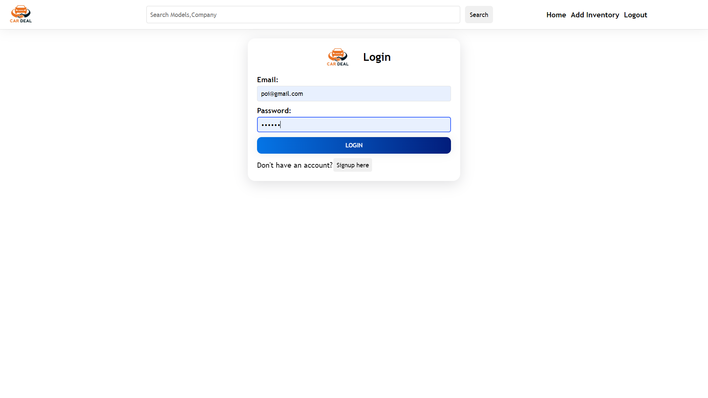

# BUYC Web Application!

Welcome to the BUYC Web Application! This web application allows you to browse and watch a collection of Cars

## Table of Contents

- [About](#about)
- [Features](#features)
- [Getting Started](#getting-started)
- [Usage](#usage)
- [Technologies Used](#technologies-used)
- [Deployment](#deployment)
- [Contributing](#contributing)
- [License](#license)

## About

BUYC Web Application! is a web application designed to help dealers to  easily access second hand cars
## Features

- Browse a collection of cars.
- Add second hand cars to the inventry
- see the collection of second hand cars withe specification
- Filter cars by color,Milage,Price.

## Screenshots

## Deployment

Deployed Link:-https://buyc-1ixk38weo-abu1osama.vercel.app

## Getting Started

# Clone the repository

git clone https://github.com/Abu1Osama/Attryb_assignment/tree/master

# Change directory

cd your-repo

# Install dependencies

npm install

# Start the development server

npm start

## Technologies Used

- BUYC Web Application! is built using the following technologies:

- React.js
- scss
- Axios
- JavaScript
- Redux

## Usage

- Visit the application in your web browser at http://localhost:3000 or the URL https://buyc-1ixk38weo-abu1osama.vercel.app .
- Browse a collection of cars.
- Add second hand cars to the inventry
- see the collection of second hand cars withe specification
- Filter cars by color,Milage,Price.

